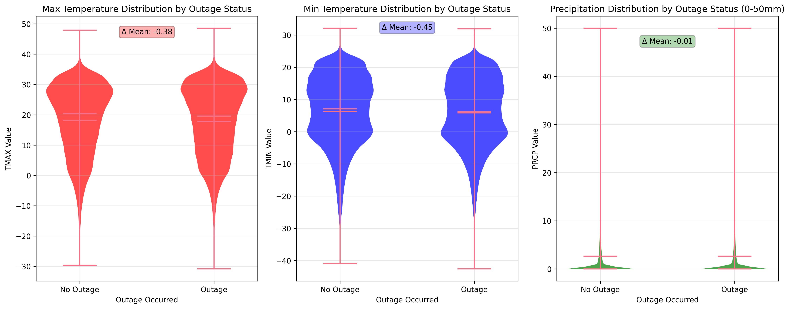
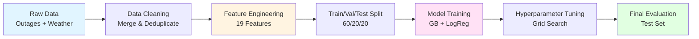

# Power Outage Prediction Using Weather Data


<br>

A machine learning project developed through Cornell Tech's AI Studio program with Abt Global to predict electrical power outages based on weather conditions using historical data from 2014-2020.

## Team Members

- **Anvika Chaudhary** - [@anvika05](https://github.com/anvika05) - Data visualization, EDA, feature engineering, final reporting
- **Ayah Almusaddy** - [@ayah-almusaddy](https://github.com/ayah-almusaddy) - Data loading, preprocessing, dimensionality reduction, data splits
- **Elizabeth Gonzalez** - [@eligone](https://github.com/eligone) - Descriptive statistics, visualizations, model training and evaluation
- **Safika Alam** - [@SAFIKAALAM-BEEP](https://github.com/SAFIKAALAM-BEEP) - Feature selection, dimensionality reduction, hyperparameter tuning, final evaluation
- **Ann Ubaka** - [@svnsvnsvn](https://github.com/svnsvnsvn) - Feature engineering, model training, hyperparameter tuning, stakeholder visualizations
- **Uyen Nguyen** - [@uyen-nguyen-190304](https://github.com/uyen-nguyen-190304) - Data loading, preprocessing, model training, bootstrapping validation, final reporting

## Project Highlights

- Worked with 3.7 million power outage records merged with daily weather data spanning 7 years (2014-2020)
- Built a Gradient Boosting classifier that achieved 73.4% accuracy and 81.1% ROC-AUC score
- Created 19 engineered features that capture everything from seasonal patterns to extreme weather events
- Discovered that location matters more than weather—county-level features were the strongest predictors of outages

## Setup and Installation

### Repository Structure

```
AI-Studio-Project/
├── data/
│   ├── raw/              # Original outage and weather data
│   └── processed/        # Cleaned and engineered datasets
├── notebooks/
│   ├── milestone_1/      # Data loading, integration, EDA, and feature engineering
│   ├── milestone_2/      # Model training (GB and Logistic Regression)
│   └── milestone_3/      # Hyperparameter tuning and final evaluation
├── models/               # Saved models and performance metrics
├── scripts/              # Data fetching utilities
└── manifests/            # Dataset configuration files
```

### Installation Steps

1. Clone the repository:
```bash
git clone https://github.com/BTT-Abt-Global-1A/AI-Studio-Project.git
cd AI-Studio-Project
```

2. Install required packages:
```bash
pip install pandas numpy scikit-learn matplotlib seaborn plotly jupyter
```

3. Run notebooks in sequence:
   - Start with `notebooks/milestone_1/01_data_loading.ipynb`
   - Follow through milestone folders numerically
   - Each notebook includes setup cells for environment configuration

## Project Overview

### What We're Trying to Solve

We wanted to build a model that predicts electrical power outages using weather data. The goal? Help utilities and emergency services get ahead of disruptions before they happen.

### Why This Matters

Power outages aren't just an inconvenience: they cost money and put people at risk. If we can predict when and where outages are likely to occur, we can:
- Help utility companies position repair crews and equipment before storms hit
- Give emergency services a heads-up so they can allocate resources where they're needed most
- Let communities know when to prepare for potential blackouts
- Enable grid operators to take preventive action to reduce load

### Our Approach

We used 7 years of historical data (2014-2020) to build binary classification models that predict whether an outage will occur based on weather conditions. We started with a goal of hitting 85% accuracy, though as you'll see later, the real world had other plans.

## Data Exploration

### Datasets

**1. EAGLE-I Outage Data** (Figshare)
- **Source**: Department of Energy's Environment for Analysis of Geo-Located Energy Information
- **Size**: 3.7M records across 7 years (2014-2020)
- **Structure**: County-level daily outage counts with temporal and geographic identifiers
- **Key fields**: `state`, `county`, `county_fips`, `run_start_time`, `sum_customers_out`

**2. NOAA Daily Weather Grids** (National Weather Service API)
- **Source**: National Oceanic and Atmospheric Administration
- **Coverage**: County-level daily weather measurements
- **Variables**: Maximum temperature (`tmax`), minimum temperature (`tmin`), precipitation (`prcp`)
- **Structure**: Monthly CSV files with scaled measurements

### Data Preprocessing

Here's what we did to get the data ready:
- **Merged datasets**: Combined outage and weather data using county FIPS codes and dates
- **Handled missing data**: Dropped records with missing weather info (about 3% of the dataset)
- **Created our target**: Made a binary `outage_occurred` flag—1 if any customers lost power, 0 otherwise
- **Built features**: Created temporal patterns, weather extremes, and regional indicators
- **Dealt with imbalance**: Our dataset had 69% outage days and 31% normal days, so we used stratified sampling to keep things fair

### What We Learned from Exploring the Data

1. **Timing matters**: Outages spike in summer (June-August) and winter (December-February)—basically when it's either scorching hot or freezing cold. Interestingly, weekends see slightly fewer outages.

2. **Location, location, location**: The South and East Coast get hit harder, especially during hurricane season. County and state turned out to be our best predictors, which tells us this is as much about infrastructure as it is about weather.

3. **Weather patterns**: 
   - Extreme temps (above 95°F or below 20°F) are strongly linked to outages
   - Daily temperature swings show a weak but consistent relationship
   - Rain by itself? Not a great predictor. It needs to team up with other factors to matter.

4. **The big surprise**: Geographic features completely dominated our models. This suggests outages depend heavily on local infrastructure quality and maintenance—weather is more of a trigger than the root cause.

### Visualizations


*Temperature and precipitation distributions show clear differences between outage and non-outage days, with extreme values more common during outages.*


*Geographic analysis reveals the South and Northeast regions experience the highest outage rates, reflecting both weather patterns and infrastructure factors.*

## Model Development

### Why These Models?

We went with two different approaches that complement each other:

1. **Gradient Boosting Classifier**: This was our heavy hitter. It's great at catching non-linear patterns and interactions between features—exactly what we needed for understanding how weather and location interact to cause outages. Plus, it handles imbalanced data pretty well.

2. **Logistic Regression**: We used this as our baseline to see what a simpler, more interpretable model could do. It helped us confirm that yeah, there are complex patterns in the data that need a more sophisticated approach.

### Technical Approach

Here's how we built the pipeline from raw data to predictions:



**Feature Engineering** (19 final features we engineered):
- **Temporal features**: Cyclical encoding of time (like `day_of_week_sin`, `day_of_year_cos`), month, day, and a weekend flag
- **Weather features**: Temperature extremes, temperature stress indices, and precipitation categories
- **Geographic features**: Target-encoded state and region (which turned out to be our MVPs), plus categorical versions
- **Composite features**: Combined extreme conditions and high-risk season flags

**How We Trained the Models**:
- Split data chronologically: 60% training, 20% validation, 20% testing
- Stratified by month so each split had similar seasonal representation
- Used grid search with 3-fold cross-validation to tune hyperparameters
- Tracked multiple metrics: Accuracy, Precision, Recall, F1, and ROC-AUC

**Best Hyperparameters (Gradient Boosting)**:
- `n_estimators`: 50
- `max_depth`: 7
- `learning_rate`: 0.3
- `min_samples_leaf`: 50
- `subsample`: 0.8

## Code Highlights

### Key Files

**Notebooks**:
- `notebooks/milestone_1/02_data_integration_eda.ipynb`: Merges weather and outage data, performs comprehensive EDA with 8 visualizations
- `notebooks/milestone_1/04_feature_engineering_selection.ipynb`: Creates 19 engineered features, performs univariate selection and PCA
- `notebooks/milestone_2/03_gradient_boosting.ipynb`: Initial GB model training with baseline metrics
- `notebooks/milestone_3/01_hyperparameter_tuning_gradient_boosting.ipynb`: Grid search optimization and final model evaluation

**Utilities**:
- `notebooks/utils/notebook_utils.py`: Shared functions for environment setup, data loading, feature preparation, and model artifact saving

**Scripts**:
- `scripts/fetch_outages.py`: Downloads EAGLE-I outage data from Figshare
- `scripts/fetch_daily_grids.py`: Fetches NOAA weather grids via API

## Results & Key Findings

### Model Performance

| Model | Accuracy | Precision | Recall | F1 Score | ROC-AUC |
|-------|----------|-----------|--------|----------|---------|
| **Gradient Boosting (tuned)** | **73.4%** | **71.2%** | **71.3%** | **71.3%** | **81.1%** |
| Logistic Regression (tuned) | 68.3% | 64.4% | 70.5% | 67.3% | 74.6% |

The tuned Gradient Boosting model outperforms Logistic Regression across all metrics, with particularly strong ROC-AUC indicating good discrimination between classes.

### Feature Importance

Top 5 predictive features:
1. **County-level encoding** (68.6%) - Dominant predictor, capturing local infrastructure and weather patterns
2. **State-level encoding** (17.3%) - Regional characteristics and policies
3. **Day of year (cyclical)** (4.1%) - Seasonal patterns
4. **Month name** (1.8%) - Monthly variations
5. **Maximum temperature** (1.7%) - Direct weather impact

Weather features contribute less than expected, suggesting infrastructure and location are stronger drivers of outages.

### How We Stack Up Against a Naive Approach

If we just guessed "outage" every time (since outages happen 69% of the time), we'd get 69% accuracy but completely miss the point—we'd never correctly identify the days without outages. Our model does better:
- **4.4 percentage points** better than just guessing the majority class
- **71.3% recall** means we're actually catching most of the outages
- Nice balance between precision and recall—we're not sacrificing one for the other

## Discussion and Reflection

### What Worked Well

- **Target encoding geographic features**: This was a game-changer. It let our model learn location-specific patterns way better than simple categorical encoding.
- **Cyclical time features**: Encoding day of week and day of year as sine/cosine waves captured seasonal patterns perfectly.
- **Gradient Boosting**: It did exactly what we needed—found those complex, non-linear relationships in the data.
- **Careful data splitting**: By stratifying our train/val/test splits by month, we avoided data leakage while keeping the evaluation realistic.

### What Didn't Work (And What We Learned)

- **PCA was a letdown**: We tried dimensionality reduction thinking it would help, but it actually hurt performance. The original features were just more meaningful.
- **Precipitation by itself**: Rain and snow alone didn't tell us much. They only mattered when combined with temperature extremes.
- **Simple thresholds**: Our initial "if temp > X, then outage" rules were too simplistic. We needed engineered features that captured interactions.
- **That 85% accuracy goal**: We aimed high at 85% but landed at 73.4%. The data just doesn't support higher accuracy with what we have.

### Why Things Turned Out This Way

Here's the thing: geography dominated everything. This tells us that outages aren't really about weather—they're about **infrastructure**. Weather is the match, but the condition of the electrical grid determines whether it lights a fire.

Think about it: the same snowstorm hits two different counties, but one loses power and the other doesn't. That's infrastructure age, maintenance quality, and grid design at work.

Our model's 73% accuracy probably reflects some hard limits:
- We're missing key info like how old the equipment is, grid capacity, and maintenance schedules
- Different utilities report outages differently, which adds noise
- Power grids fail in complex, cascading ways that don't show up in daily county-level data

## Next Steps

If we had more time (and data access), here's what we'd do:

1. **Get infrastructure data**: Add grid topology, equipment age, and maintenance records. Also bring in socioeconomic data like population density and utility budgets.

2. **Try time series models**: LSTMs or temporal CNNs could capture multi-day weather patterns and how failures cascade over time.

3. **Predict severity, not just occurrence**: Instead of just "yes/no" for outages, predict how many customers will lose power and for how long.

4. **Build ensembles**: Combine multiple model types or create regional sub-models that specialize in specific areas.

5. **Make it real-time**: Build an API that pulls live weather data and gives continuous predictions. That's where the real value would be.

6. **Explain the predictions**: Use SHAP values to understand why the model predicts what it does—crucial for getting buy-in from utilities and emergency managers.

---

<div align="center">
  <i>This project was developed as part of Cornell Tech's AI Studio program in collaboration with Abt Global.</i>
</div>
